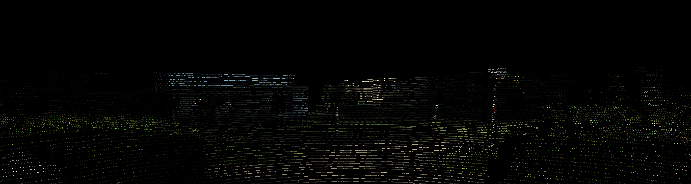
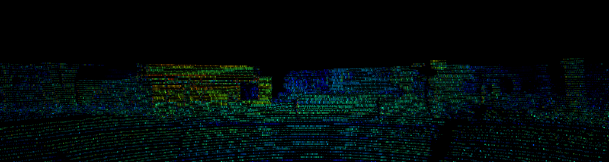
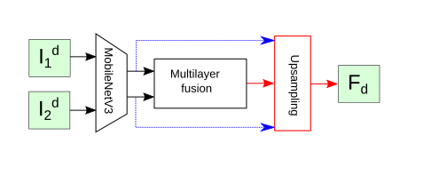

# DeepLabFusion
Deep Neural Network for fusion point clouds and images with DeepLabV3+ and custom layers

Main idea of the project is applying image decomposition principles from the paper "Infrared and Visible Image Fusion using a Deep
Learning Framework" (DOI: 10.1109/ICPR.2018.8546006) to point cloud and image fusion. It may be  a wrong way, but
it can bring some nice ideas while working with it.

Applied to image this principle told us that some image can be decomposed to the base and detail components.
Below I provide example for sample image from KITTI dataset:

# Preprocessing

Original image


Base component



Detail component




Next, the same decomposition applied to front and bev point cloud projections. The sample point cloud also taken
from KITTI dataset and contains four components: X, Y, Z, I, where I is intensity. 

Front projection (Intensity channel):


Front projection (Deep channel):


For bird's eye view projection we need obtain colored projected point cloud in order to fuse with ordinary cloud.

RGB bird's eye view:


BEV (Height channel):


BEV (Intensity channel):


# Decomposition

## Base decomposition
According to cited paper, base decomposition contains two equations:
```math
\begin{align*}
    I_b &= \underset{I_b}{\arg\max} ||I - I^b||_F^2 + \lambda\left(||g_x * I^b||_F^2 + ||g_y * I^b||_F^2\right) \\
    I_d &= I - I_b
\end{align*}
```

Front fusion (Base part):


Bev fusion (base part):


## Detail decomposition
In order to fuse with detail components we need 
to use fusion subnetwork with technique named in original paper as multilayer fusion. In order to 
obtain realtime performance, VGG-19 Network replaced with MobileNet/V2/V3. There are the good explanation
of this method in original paper for infrared and visible cameras.



Front fusion (Detail part):


Bev fusion (Detail part):


